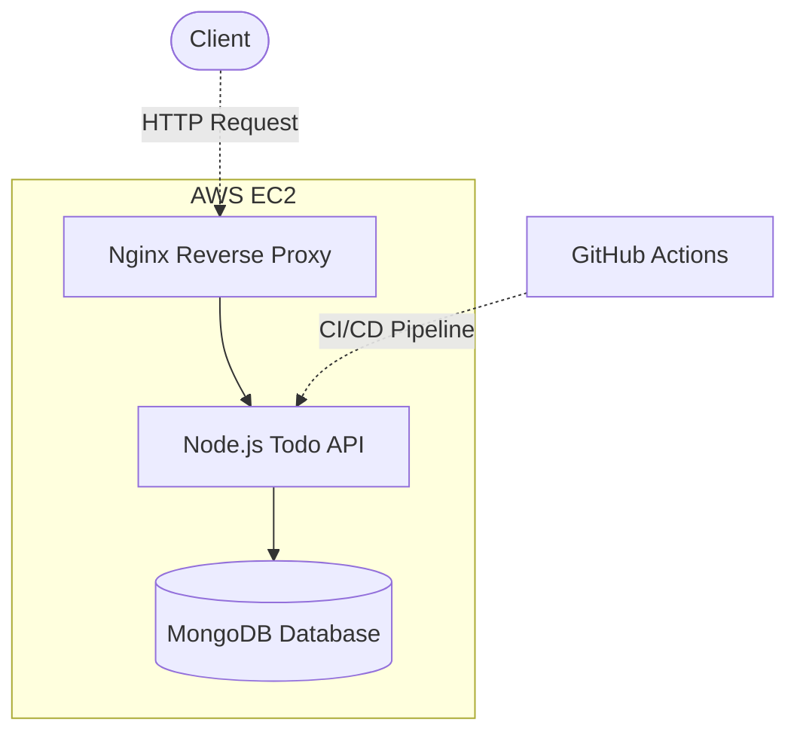

# Multi-Container Todo Application

A production-ready multi-container application deployed on AWS EC2 with automated CI/CD pipeline. The application consists of a Node.js Todo API, MongoDB database, and Nginx reverse proxy, all orchestrated using Docker Compose.

## Project Page
This project is part of the [DevOps Project Based Learning](https://roadmap.sh/projects/multi-container-service) curriculum.

## Live Demo
- **URL**: [http://mca.nikhilmishra.live](http://mca.nikhilmishra.live)
- **API Endpoints**: 
  - `GET /health` - Health check endpoint
  - `GET /api/todos` - List all todos
  - `POST /api/todos` - Create a new todo
  - `GET /api/todos/:id` - Get a specific todo
  - `PUT /api/todos/:id` - Update a todo
  - `DELETE /api/todos/:id` - Delete a todo

## Project Overview

### Architecture



### Infrastructure
- **Control Node**: 44.203.38.191 (Ubuntu)
- **Target Node**: 3.87.64.105 (Ubuntu)
- **Domain**: mca.nikhilmishra.live

## Project Structure
```
multi-container-service/
├── app/                    # Node.js Todo API
│   ├── src/               # Source code
│   │   ├── app.js        # Express application setup
│   │   ├── index.js      # Server entry point
│   │   ├── models/       # MongoDB models
│   │   └── routes/       # API routes
│   ├── test/             # Test files
│   ├── Dockerfile        # API container configuration
│   └── package.json      # Node.js dependencies
├── nginx/                 # Nginx configuration
│   └── conf.d/           # Nginx server blocks
├── ansible/              # Ansible playbooks
│   ├── inventory/        # Host definitions
│   └── playbooks/        # Deployment playbooks
├── .github/workflows/    # GitHub Actions CI/CD
├── .env                  # Environment variables
└── docker-compose.yml    # Container orchestration
```

## Implementation Details

### 1. Node.js Todo API
- Express.js framework
- MongoDB with Mongoose ODM
- RESTful endpoints
- Health check endpoint
- Error handling middleware
- Input validation

### 2. Docker Configuration
- Multi-container setup with Docker Compose
- Optimized Dockerfile with multi-stage builds
- Volume management for data persistence
- Container networking
- Environment-specific configurations

### 3. Nginx Reverse Proxy
- Load balancing
- SSL/TLS termination (planned)
- Static file serving
- Proxy configuration
- Security headers

### 4. CI/CD Pipeline (GitHub Actions)
- Automated testing
- Docker image building
- Container registry publishing
- Automated deployment
- Health checks

## Proof of Implementation

### 1. Health Check
```bash
$ curl http://mca.nikhilmishra.live/health
{"status":"ok","mongodb":"connected"}
```

### 2. Create Todo
```bash
$ curl -X POST -H "Content-Type: application/json" \
  -d '{"title":"Test Todo","description":"Testing the API"}' \
  http://mca.nikhilmishra.live/api/todos

{
  "title": "Test Todo",
  "description": "Testing the API",
  "completed": false,
  "_id": "67aafed247e49f9194b3e805",
  "createdAt": "2025-02-11T10:20:08.462Z",
  "updatedAt": "2025-02-11T10:20:08.462Z"
}
```

### 3. List Todos
```bash
$ curl http://mca.nikhilmishra.live/api/todos
[
  {
    "_id": "67aafed247e49f9194b3e805",
    "title": "Test Todo",
    "description": "Testing the API",
    "completed": false,
    "createdAt": "2025-02-11T10:20:08.462Z",
    "updatedAt": "2025-02-11T10:20:08.462Z"
  }
]
```

## Development Setup

### Prerequisites
- Docker and Docker Compose
- Node.js >= 14.0.0
- Git
- Ansible

### Local Development
1. Clone the repository
   ```bash
   git clone https://github.com/kaalpanikh/multi-container-service.git
   cd multi-container-service
   ```

2. Install dependencies
   ```bash
   cd app
   npm install
   ```

3. Start the development environment
   ```bash
   docker-compose up -d
   ```

4. Access the API at http://localhost:3000

## Deployment

### Infrastructure Setup
1. Provision AWS EC2 instances for control and target nodes
2. Configure security groups and networking
3. Set up DNS records

### Automated Deployment
1. Push changes to the main branch
2. GitHub Actions will:
   - Run tests
   - Build Docker images
   - Push to container registry
   - Deploy to target node
   - Perform health checks

## Future Improvements
1. Add HTTPS support with Let's Encrypt
2. Implement container health checks
3. Add monitoring with Prometheus/Grafana
4. Set up log aggregation
5. Implement blue-green deployment

## Contributing
1. Fork the repository
2. Create a feature branch
3. Commit your changes
4. Push to the branch
5. Create a Pull Request

## License
MIT

## Project Status
✅ CI/CD Pipeline: Working
✅ API Endpoints: Working
✅ MongoDB: Connected
✅ Nginx: Configured
